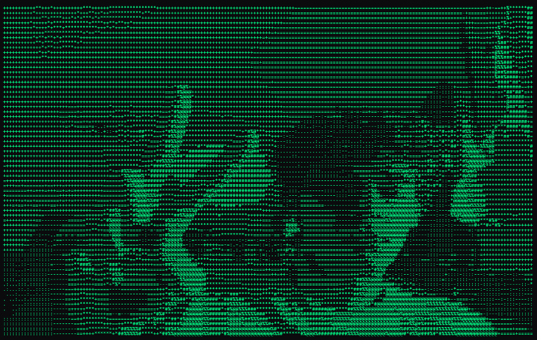

# ASCII Camera
ASCII render en vivo desde tu cámara usando el navegador.

## Probar online
Abre la demo aquí: https://nananaim.github.io/ASCII-camera/

## Requisitos
- Un navegador moderno (Chrome, Edge, Firefox). 

## Uso
- Pulsa "Iniciar cámara" y concede permisos.
- Ajusta `Densidad` (resolución de muestreo): más densidad = más detalle pero menos FPS.
- Al aumentar `Densidad`, se generan más columnas/filas dentro del mismo espacio visible.
- Cambia `Ancho (cols)` para más/menos columnas.
- Prueba distintos `Charset` y la opción `Invertir` para diferentes estilos.
- "Detener" apaga la cámara y libera recursos.
- Personaliza colores del ASCII 

## Notas
- El aspecto de los caracteres es más alto que ancho; se aplica una corrección interna para evitar la imagen aplastada.
- Si el rendimiento es bajo, reduce la `Escala` o las `cols`.

